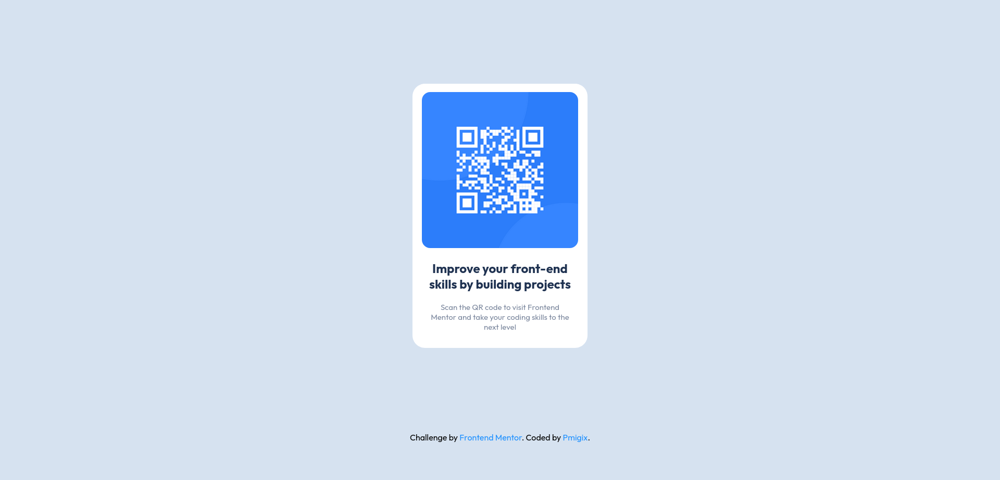

# Frontend Mentor - QR code component solution

This is a solution to the [QR code component challenge on Frontend Mentor](https://www.frontendmentor.io/challenges/qr-code-component-iux_sIO_H). Frontend Mentor challenges help you improve your coding skills by building realistic projects. 

## Table of contents

- [Overview](#overview)
  - [Screenshot](#screenshot)
  - [Links](#links)
- [My process](#my-process)
  - [What I learned](#what-i-learned)
  - [Continued development](#continued-development)
- [Author](#author)

## Overview

### Screenshot



### Links

- Live Site URL: https://pmigix.github.io/qr-code-component/
## My process

### What I learned

I'm getting a hang of DIVs and making sure content is positioned properly.

```css
.proud-of-this-css {
  display: flex;
  justify-content: center;
  align-items: center;
}

.useful-one {
  margin: 0 auto;
}
```

### Continued development

For future projects I'd like to refine my responsive web design skills, especially for smaller screen sizes so that it doesn't look like tornado ran through breaking everything along the way.
Also - staying consistent with upcoming challenges.

## Author

- Frontend Mentor - [@pmigix](https://www.frontendmentor.io/profile/pmigix)